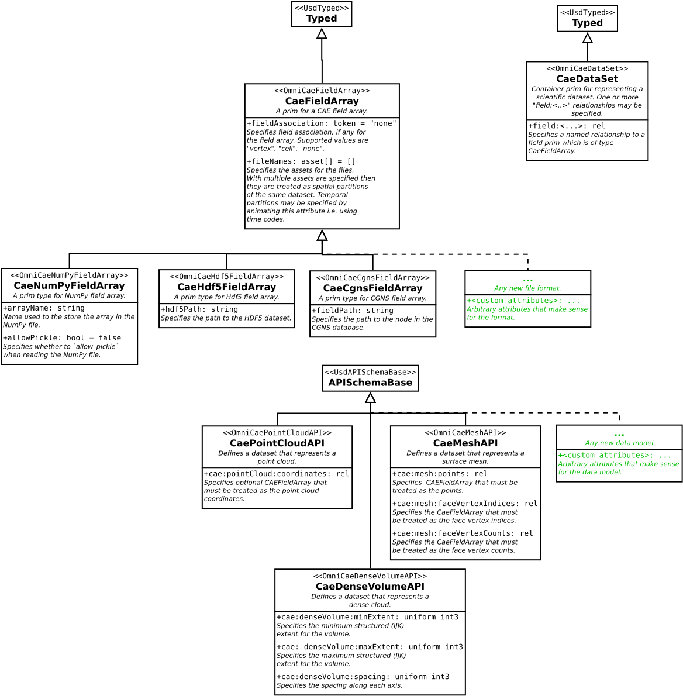

# USD Schemas for CAE

This document describes the USD schemas designed to support CAE (Computer-Aided Engineering) use cases in Omniverse.

## Overview

To support CAE use cases, Kit-CAE extends USD with new prim types that help represent scientific datasets while preserving native file formats and mechanisms.

## Core Schema Elements

### `CaeDataSet` Prim

The `CaeDataSet` prim type is similar to `UsdVolVolume` and acts as a representative for any scientific dataset. It serves as the primary container for CAE data in a USD stage.

### `CaeFieldArray` Prim

`CaeFieldArray` and its subtypes represent data arrays stored in different files or assets. To support new file types, define new subtypes, such as:

- `CaeCgnsFieldArray` - For CGNS files
- `CaeNumPyFieldArray` - For NumPy arrays
- `CaeHdf5FieldArray` - For HDF5 files
- And more...

### Data Model API Schemas

Information about how to interpret `CaeDataSet` and its arrays is provided using single-apply API schemas. These schemas describe the structure and organization of the data.

Current API schemas include:

- **`CaePointCloudAPI`** - For point cloud data models
- **`CaeSidsUnstructuredAPI`** - For SIDS (Standard Interface Data Structures) unstructured data models

## Design Philosophy

The schema design follows these principles:

1. **Preserve Native Formats**: Data can remain in its original format (CGNS, HDF5, VTK, etc.) rather than requiring conversion
2. **Minimize Duplication**: External asset references reduce data duplication
3. **Extensibility**: New file formats can be supported by defining new `CaeFieldArray` subtypes
4. **Flexibility**: API schemas allow different data models to coexist

## Related Schemas

Kit-CAE also includes specialized schemas for specific use cases:

- **EnSight Schema** ([OmniCaeEnSight.schema.svg](./OmniCaeEnSight.schema.svg)) - For EnSight data
- **VTK Schema** ([OmniCaeVtk.schema.svg](./OmniCaeVtk.schema.svg)) - For VTK data
- **SIDS Schema** ([OmniCaeSids.schema.svg](./OmniCaeSids.schema.svg)) - For CGNS/SIDS data

## Schema Implementation

The USD schemas are implemented in the [source/schemas/](../source/schemas/) directory and loaded into Omniverse through the [`omni.cae.schema`](../source/extensions/omni.cae.schema/) extension.

For more details on how these schemas are used in practice, see:
- [Extensions Overview](./Extensions.md)
- [Data Delegate API](./DataDelegate.md)
- [CAE Viz Schemas](./CaeVizSchemas.md) - Visualization operator schemas that consume `CaeDataSet` prims

## Example Usage

Example USD files demonstrating schema usage are available in the [docs/examples/usda/](./examples/usda/) directory.
