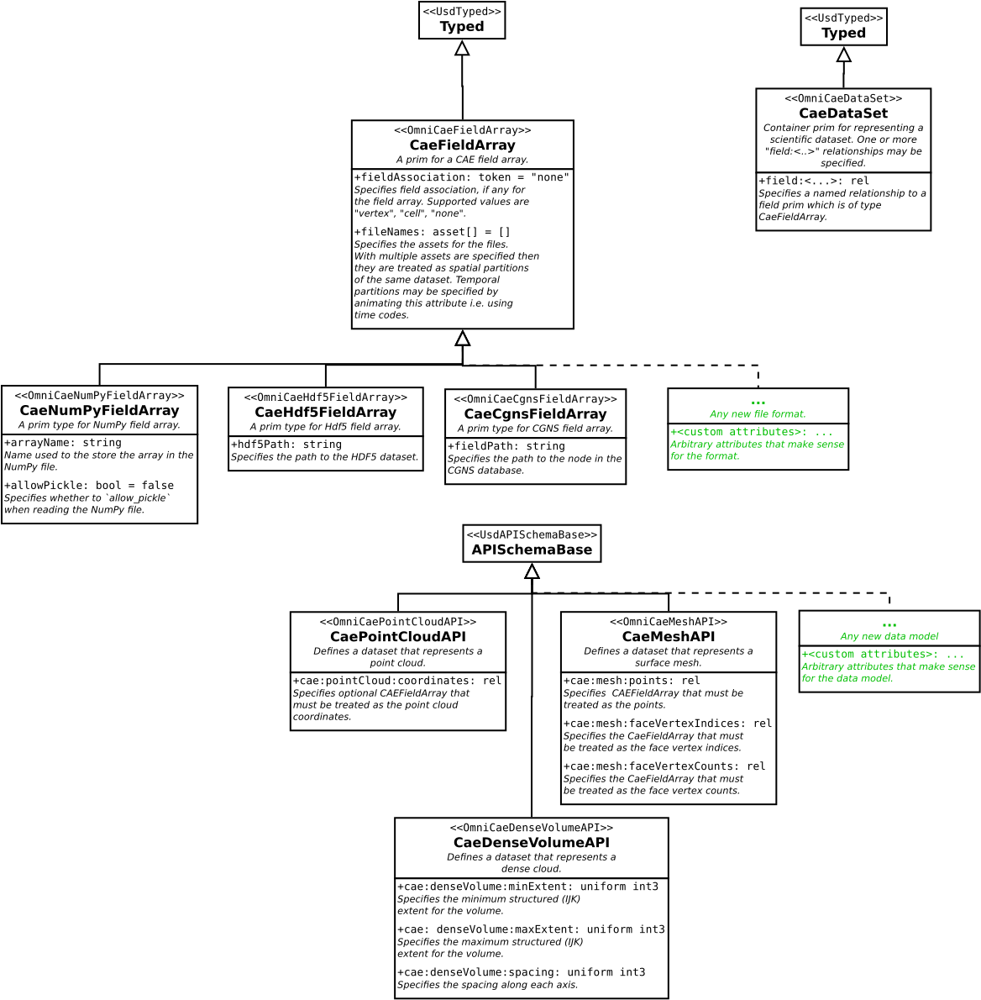
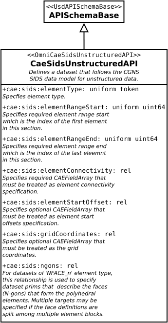
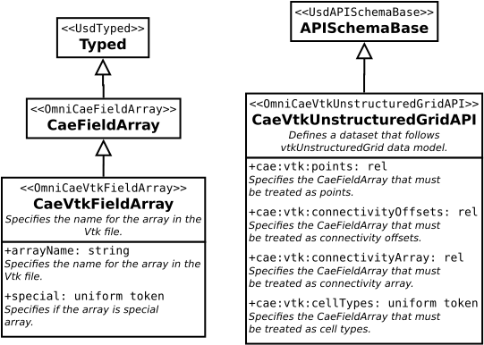
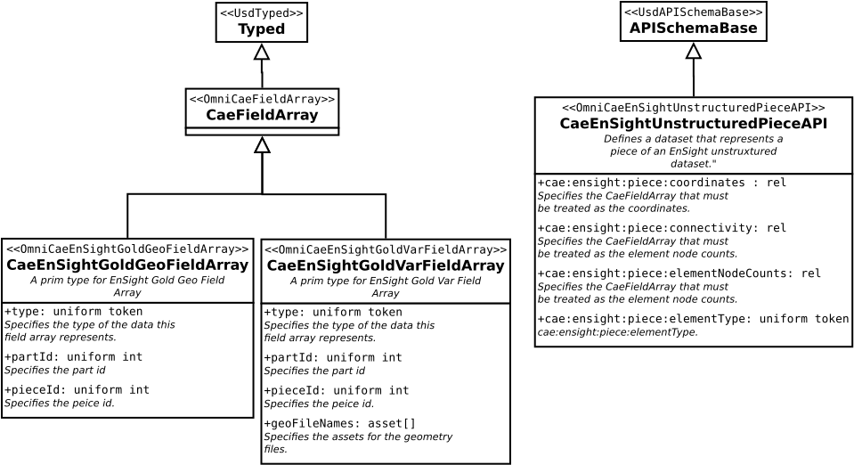

# Omni CAE USD Schema

## TLDR;

This extension proposes a USD schema for scientific datasets in Computer-Aided Engineering and Simulation workflows. A
short summary of our design is as follows:

* `OmniCaeDataSet` is new prim type to represent scientific datasets. `OmniCaeDataSet` is similar to `UsdVolVolume` and
  exposes API for adding field relationships.
* `OmniCaeFieldArray` is a new prim type used to represent individual field arrays in datasets. This is similar to
  `UsdVolFieldBase`. Format specific subtypes can be defined for support different file formats or in-memory storage.
* Single-apply API schemas are used to add data model specific properties to `OmniCaeDataSet` prims. These API schemas
  help the USD applications to correctly interpret the data described by the `OmniCaeDataSet`.

`OmniCaeDataSet` and `OmniCaeFieldArray` would easily have been subtypes of `UsdVolVolume` and `UsdVolFieldBase`
respectively. However, that leads to ambiguity since strictly speaking a CAE dataset is not necessarily a 3D volume and could
easily be representing a 2D mesh, defined in USD using `UsdGeomMesh`. To avoid this confusion, we add these as separate types.

## Introduction

### Data Model

At its core, any scientific dataset is merely a collection of data arrays. Agreed upon conventions on how to interpret
those arrays helps us describe complex data structures using simple data arrays. **Data model** is simply a collection
of such conventions for a specific application or domain.

To understand this concept, consider USD's schema for representing 3D surface meshes using `UsdGeomMesh`.
The specification requires three arrays named `points`, `faceVertexIndices`, and `faceVertexCounts` of
defined type and form. If we have triangle mesh, for example, given this `UsdGeomMesh` specification, we can describe the
triangle mesh using the required arrays. Thus, we can say `UsdGeomMesh` schema defines a data model for representing
surface meshes. There are of course, arbitrarily many ways of defining surface meshes. For example, if our application
only works triangle meshes, we can simply the data model by only requiring the `points` array and implicitly treating
them as sequence of 3 points, each defining a triangle in counter-clockwise order. For our application, this then
becomes the data model. Applications adopt different data models based on their specific needs and trade offs.
Here, for example, this triangle-mesh data model trades flexibility for memory efficiency and simplicity when compared with
the `UsdGeomMesh` data model.

Scientific codes have adopted a wide variety of data models. We want to ensure that any and all of them can be expressed
in USD.

### File Formats

Data models help us interpret scientific data in memory. Similarly, file formats help us
save / restore scientific data to files. In some cases, data model and file format go hand in hand,
for example `CGNS` includes both a file format and a data model. More often than not, when one says
CGNS, they are referring to `.cgns` files. However, CGNS also includes a
`Standard Interface Data Structures (SIDS)` specification which forms the **data model**.

In our design, we explicitly decouple the file format from the data model. This decoupling gives us the flexibility to mix
and match the two with ease.

### Example

Here's a simple example representing an unstructured dataset stored in a CGNS file.

```usda
def Xform "World"
{
    def Xform "DataSetHex"
    {
        def CaeDataSet "ElementSet" (
            # application of the API tells application how to interpret the field arrays.
            # here, we're indicating this dataset is using CGNS's SIDS data model for
            # unstructured datasets.
            prepend apiSchemas = ["CaeSidsUnstructuredAPI"]
        )
        {
            # these are attributes introduced by the CaeSidsUnstructuredMeshAPI schema.
            token cae:sids:elementType = "HEXA_8"
            uint64 cae:sids:elementRangeMin = 1
            uint64 cae:sids:elementRangeMax = 1025
            rel cae:sids:gridCoordinates = [<Arrays/CoordinatesX>, <Arrays/CoordinatesY>, <Arrays/CoordinatesZ>]
            rel cae:sids:elementConnectivity = <Arrays/Connectivity>

            # fields using to represent data arrays
            rel field:pressure = <Arrays/Pressure>
            rel field:temperature = <Arrays/Temperature>

            def Scope "Arrays"
            {
                # here `class` together with `specializes=` is used to avoid repeating the
                # common properties for all field arrays.
                class "StaticMixerFieldArray"
                {
                    asset[] fileNames = [@/tmp/staticMixer.cgns@]
                }
                def CaeCgnsFieldArray "Pressure" ( specializes=<../StaticMixerFieldArray>)
                {
                    uniform token fieldAssociation = "vertex"
                    string fieldPath = "/Base1/Zone1/FlowSolution/Pressure"
                }
                def CaeCgnsFieldArray "Temperature" ( specializes=<../StaticMixerFieldArray>)
                {
                    uniform token fieldAssociation = "vertex"
                    string fieldPath = "/Base1/Zone1/FlowSolution/Temperature"
                }
                def CaeCgnsFieldArray "CoordinatesX" ( specializes=<../StaticMixerFieldArray>)
                {
                    uniform token fieldAssociation = "vertex"
                    string fieldPath = "/Base1/Zone1/GridCoordinates/CoordinatesX"
                }
                def CaeCgnsFieldArray "CoordinatesY" ( specializes=<../StaticMixerFieldArray>)
                {
                    uniform token fieldAssociation = "vertex"
                    string fieldPath = "/Base1/Zone1/GridCoordinates/CoordinatesY"
                }
                def CaeCgnsFieldArray "CoordinatesZ" ( specializes=<../StaticMixerFieldArray>)
                {
                    uniform token fieldAssociation = "vertex"
                    string fieldPath = "/Base1/Zone1/GridCoordinates/CoordinatesZ"
                }
                def CaeCgnsFieldArray "Connectivity" ( specializes=<../StaticMixerFieldArray>)
                {
                    uniform token fieldAssociation = "none"
                    string fieldPath = "/Base1/Zone1/ElementSet1/ElementConnectivity"
                }
            }
        }
    }
}
```

## CAE Schemas

To support CAE datasets, we introduce two new base prim types: `CaeDataSet` and `CaeFieldArray`. `CaeDataSet` represents
a singular dataset or mesh. Scientific datasets often comprise of elemental datasets that are organized into hierarchies
or classified under groups to represents deferent components in the application domain.
`CaeDataSet` does not represent such composites, instead is intended for a single atomic dataset.
In USD, `CaeDataSet` is simply a container for `CaeFieldArray` prims specified as relationships named with `field:`
namespace. This notion of specifying fields is intentionally similar to `UsdVolVolume`. `CaeFieldArray`, is similar to
`UsdVolFieldBase` and is intended to represent individual data arrays that comprise the dataset.
Concrete subtypes can be added for `CaeFieldArray` for specific file formats and external data stores. Our initial
implementation includes two subtypes: `CaeCgnsFieldArray` and `CaeNumPyFieldArray` for representing data arrays stored
in CGNS (`*.cgns`) and NumPy (`*.npy`, `*.npz`) files.

Next, we need a means to specify the data model. In other words, we need a mechanism to indicate how to interpret
these arrays. For that, we use single-apply API schemas. To add support for a data model, one simply needs to introduce
an API schema for that data model and apply it to `CaeDataSet` prim. The attributes and relationships on the API schema
can then help applications understand how to interpret the field-arrays.
`CaeSidsUnstructuredAPI`, for example, is an API schema that can be used for any datasets that follows
the CGNS `Standard Interface Data Structures (SIDS)` data model for unstructured element sets aka `Element_t` nodes.

The schemas are organized into
four packages: one core package: `OmniCae`, and three technology specific packages: `OmniCaeSids`, `OmniCaeVtk`,
and `OmniCaeEnSight`. Let's take a closer look at each of these schemas.

### OmniCae Schemas

The `OmniCae` package includes the core schemas, `CaeDataSet`, and `CaeFieldArray`.
`CaeNumPyFieldArray`, `CaeHdf5FieldArray`, and `CaeCgnsFieldArray` are specializations of `CaeFieldArray` for reading
data arrays from `npz`, `hdf5`, and `cgns` files respectively. In addition, `OmniCae` package includes several basic
API schemas that can be applied to `CaeDataSet` to define datasets for defining some typical data models / types, viz.
`CaePointCloudAPI`, `CaeMeshAPI`, and `CaeDenseVolumeAPI`.

The following diagram illustrates the relationships between these schemas and their properties. The dotted lines indicate
where new schema types can be potentially added to support new data models or file formats thus making for a flexible and
extensible design.



#### CaeDataSet

`CaeDataSet` schema describes a dataset composed of multiple fields. A field is a relationship pointing to a prim of
type `CaeFieldArray` or one of its subtypes. One can apply API schemas to a `CaeDataSet` prim to indicate
to applications the data model to use to interpret the field arrays.

```usda
# CaeDataSet schema definition
class CaeDataSet "CaeDataSet" (
    inherits = </Typed>
    customData = {
        string className = "DataSet"
    }
    doc = """A scientific dataset. A dataset is made up of any number of CaeFieldArray
             primitives bound together in this dataset. Each CaeFieldArray primitive is specified as a
             relationship with namespace prefix of "field"."""
)
{
}
```

#### CaeFieldArray

`CaeFieldArray` is the base type for all field arrays and is a schema
representing a single dataset field. This schema should be inherited to add
support for reading data arrays from various file formats. The schema definition is as follows:

```usda
# CaeFieldArray schema definition
class CaeFieldArray "CaeFieldArray" (
    inherits = </Typed>
    customData = {
        string className = "FieldArray"
    }
)
{
   asset[] fileNames = [] (
        doc = """Specifies the assets for the files. With multiple assets
            are specified then they are treated as spatial partitions of the same
            dataset. Temporal partitions may be specified by animating this attribute
            i.e. using time codes.
            """
        displayName = "File Names"
    )

    uniform token fieldAssociation = "none" (
        allowedTokens = [ "none", "vertex", "cell" ]
        doc = "Specifies the dataset element this field array is associated with."
        displayName = "Field Association"
    )
}
```

`fileNames` attribute is used to specify asset paths to data stored outside of USD.
It can be used to represent temporally and spatially partitioned files as illustrated by the following examples:

```usda
def CaeFieldArray "SingleFile"
{
  asset[] fileNames = [@data/test.cgns@]
}

def CaeFieldArray "PartitionedFiles"
{
  asset[] fileNames = [@data/test_0_2.pvtk@,
                       @data/test_1_2.pvtk@]
}

def CaeFieldArray "TemporalFileSequence"
{
  asset[] fileNames.timeSamples = {
    0:  [@data/test_0.cgns@],
    10: [@data/test_1.cgns@],
    20: [@data/test_2.cgns@]
  }
}

def CaeFieldArray "TemporalPartitionedFiles"
{
  asset[] fileNames.timeSamples = {
    0:  [@data/test_0_0_2.pvtk@, @data/test_0_1_2.pvtk@],
    10: [@data/test_10_0_2.pvtk@, @data/test_10_1_2.pvtk@],
    20: [@data/test_20_0_2.pvtk@, @data/test_20_1_2.pvtk@]
  }
}
```

`fieldAssociation` attribute can optionally specify which element type the field array is associated with.

#### CaeHdf5FieldArray

`CaeHdf5FieldArray` inherits from `CaeFieldArray` and is a concrete schema for field arrays
stored in a HDF5 dataset. Attribute `hdf5Path` can be used to specify the HDF5 dataset path.

```usda
# CaeHdf5FieldArray schema definition
class CaeHdf5FieldArray "CaeHdf5FieldArray" (
    inherits = </CaeFieldArray>
    customData = {
        string className = "Hdf5FieldArray"
    }
)
{
    string hdf5Path = "" (
        doc = "Specifies the path to the HDF5 dataset."
        displayName = "Hdf5 Path"
    )
}
```

#### CaeCgnsFieldArray

`CaeCgnsFieldArray` inherits from `CaeFieldArray` and is a concrete schema for field arrays
stored in a CGNS asset. Attribute `fieldPath` can be used to specify the CGNS node path to
the `DataArray_t` node containing the data.

```usda
# CaeCgnsFieldArray schema definition
class CaeCgnsFieldArray "CaeCgnsFieldArray" (
    inherits = </CaeFieldArray>
    doc = "Defines a CGNS data array"
    customData = {
        string className = "CgnsFieldArray"
    }
)
{
    string fieldPath = "" (
        doc = "Specifies the path to the node in the CGNS database."
    )
}
```

#### CaeNumPyFieldArray

`CaeNumPyFieldArray` inherits from `CaeFieldArray` and is a concrete schema for field arrays
stored in a NumPy asset. `arrayName` is a string that identifies a specific array from the file. `allowPickle`
controls how should the binary data be processed.

```usda
# CaeNumPyFieldArray schema definition
class CaeNumPyFieldArray "CaeNumPyFieldArray" (
    inherits = </CaeFieldArray>
    doc = "Defines a NumPy data array"
    customData = {
        string className = "NumPyFieldArray"
    }
)
{
    bool allowPickle = false (
        doc = """Specifies whether to allow pickle when reading NumPy files.
        Only enable for files from trusted sources.  Refer to NumPy documentation
        for `numpy.load` function for details and security implications."""
    )

    string arrayName = "" (
        doc = "Specifies the name for the array in the NumPy file."
    )

}
```


#### CaePointCloudAPI

`CaePointCloudAPI` is a single-apply API schema for describing datasets that are to be treated as point clouds.
`cae:pointCloud:coordinates` relationship can be used to specify the field array(s) that are to be treated as coordinates.

```usda
class "CaePointCloudAPI" (
    inherits = </APISchemaBase>
    doc = "Defines a dataset that represents a point cloud."
    customData = {
        string className = "PointCloudAPI"
        token apiSchemaType = "singleApply"
    }
)
{
    rel cae:pointCloud:coordinates (
        doc = """Specifies the CaeFieldArray that must be treated as the coordinates. Multiple targets
                 may be specified when individual components are split among multiple field arrays."""
        displayName = "Coordinates"
        displayGroup = "Relationships"
        customData = {
            string apiName = "coordinates"
        }
    )
}
```

#### CaeMeshAPI

`CaeMeshAPI` is a single-apply API schema for describing datasets that are to be treated as surface meshes. The relationships
on this schema specify field array(s) that have similar roles and structure as `UsdGeomMesh` prim.

```usda
class "CaeMeshAPI" (
    inherits = </APISchemaBase>
    doc = "Defines a dataset that represents a surface mesh."
    customData = {
        string className = "MeshAPI"
        token apiSchemaType = "singleApply"
    }
)
{
    rel cae:mesh:points (
        doc = "Specifies the CaeFieldArray that must be treated as the points."
        displayName = "Points"
        displayGroup = "Relationships"
        customData = {
            string apiName = "points"
        }
    )

    rel cae:mesh:faceVertexIndices (
        doc = "Specifies the CaeFieldArray that must be treated as the face vertex indices."
        displayName = "Face Vertex Indices"
        displayGroup = "Relationships"
        customData = {
            string apiName = "faceVertexIndices"
        }
    )

    rel cae:mesh:faceVertexCounts (
        doc = "Specifies the CaeFieldArray that must be treated as the face vertex counts."
        displayName = "Face Vertex Counts"
        displayGroup = "Relationships"
        customData = {
            string apiName = "faceVertexCounts"
        }
    )
}
```

#### CaeDenseVolumeAPI

`CaeDenseVolumeAPI` is intended for describing 3D volumetric datasets.

```usda
class "CaeDenseVolumeAPI" (
    inherits = </APISchemaBase>
    doc = "Defines a dataset that represents a dense volume."
    customData = {
        string className = "DenseVolumeAPI"
        token apiSchemaType = "singleApply"
    }
)
{
    uniform int3 cae:denseVolume:minExtent (
        doc = "Specifies the minimum structured (IJK) extent for the volume."
        displayName = "Min Extent"
        displayGroup = "Attributes"
        customData = {
            string apiName = "minExtent"
        }
    )

    uniform int3 cae:denseVolume:maxExtent (
        doc = "Specifies the maximum structured (IJK) extent for the volume."
        displayName = "Max Extent"
        displayGroup = "Attributes"
        customData = {
            string apiName = "maxExtent"
        }
    )

    uniform float3 cae:denseVolume:spacing = (1.0, 1.0, 1.0) (
        doc = "Specifies the spacing along each axis."
        displayName = "Spacing"
        displayGroup = "Attributes"
        customData = {
            string apiName = "spacing"
        }
    )
}
```

### OmniCaeSids Schemas

`OmniCaeSids` package is intended to includes single-apply API schemas for describing datasets that follow [CGNS
Standard Interface Data Structures (SIDS)](https://cgns.github.io/standard/SIDS/CGNS_SIDS.html)
data model. Currently, it includes `CaeSidsUnstructuredAPI` for unstructured
grids. We intend to add more schemas for structured grids and others types supported by SIDS as needed.



#### CaeSidsUnstructuredAPI

`CaeSidsUnstructuredAPI` is an API schema for representing CGNS SIDS unstructured element set i.e. unstructured `Element_t`.
Named relationships referring to `CaeFieldArray` nodes help indicate which field arrays are to be treated as
grid coordinates, element connectivity, etc. It also indicates to the applications specific information about the shape,
type of those field arrays. For example, element connectivity field arrays are required to 1D with vertex indices specified
starting 1.

```usda
# CaeSidsUnstructuredAPI schema definition

class "CaeSidsUnstructuredAPI" (
    inherits = </APISchemaBase>
    doc = "Defines a mesh that follows the CGNS SIDS data model for unstructured data."
    customData = {
        string className = "UnstructuredAPI"
        token apiSchemaType = "singleApply"
    }
)
{
    uniform token cae:sids:elementType = "ElementTypeNull" (
        allowedTokens = [
            "ElementTypeNull", "ElementTypeUserDefined", "NODE", "BAR_2", "BAR_3",
            "TRI_3", "TRI_6", "QUAD_4", "QUAD_8", "QUAD_9",
            "TETRA_4", "TETRA_10", "PYRA_5", "PYRA_14",
            "PENTA_6", "PENTA_15", "PENTA_18", "HEXA_8", "HEXA_20", "HEXA_27",
            "MIXED", "PYRA_13", "NGON_n", "NFACE_n",
            "BAR_4", "TRI_9", "TRI_10", "QUAD_12", "QUAD_16",
            "TETRA_16", "TETRA_20", "PYRA_21", "PYRA_29", "PYRA_30",
            "PENTA_24", "PENTA_38", "PENTA_40", "HEXA_32", "HEXA_56", "HEXA_64",
            "BAR_5", "TRI_12", "TRI_15", "QUAD_P4_16", "QUAD_25", "TETRA_22",
            "TETRA_34", "TETRA_35", "PYRA_P4_29", "PYRA_50", "PYRA_55", "PENTA_33", "PENTA_66",
            "PENTA_75", "HEXA_44", "HEXA_98", "HEXA_125"
        ]
        doc = "Specifies required element type."
        displayName = "Element Type"
        displayGroup = "Attributes"
        customData = {
            string apiName = "elementType"
        }
    )

    uniform uint64 cae:sids:elementRangeStart (
        doc = "Specifies required element range start which is the index of the first element in this section."
        displayName = "Element Range Start"
        displayGroup = "Attributes"
        customData = {
            string apiName = "elementRangeStart"
        }
    )

    uniform uint64 cae:sids:elementRangeEnd (
        doc = "Specifies required element range end which is the index of the last eleemnt in this section."
        displayName = "Element Range End"
        displayGroup = "Attributes"
        customData = {
            string apiName = "elementRangeEnd"
        }
    )

    rel cae:sids:elementConnectivity (
        doc = "Specifies required CaeFieldArray that must be treated as element connectivity specification."
        displayName = "Element Connectivity"
        displayGroup = "Relationships"
        customData = {
            string apiName = "elementConnectivity"
        }

    )

    rel cae:sids:elementStartOffset (
        doc = "Specifies optional CaeFieldArray that must be treated as element start offsets specification."
        displayName = "Element Start Offset"
        displayGroup = "Relationships"
        customData = {
            string apiName = "elementStartOffset"
        }
    )

    rel cae:sids:gridCoordinates (
        doc = """Specifies optional CaeFieldArray that must be treated as the grid coordinate. Multiple targets
        may be specified when individual components are split among multiple CaeFieldArrays."""
        displayName = "Grid Coordinates"
        displayGroup = "Relationships"
        customData = {
            string apiName = "gridCoordinates"
        }
    )

    rel cae:sids:ngons (
        doc ="""For datasets of 'NFACE_n' element type, this relationship is used to specify dataset prims that
        describe the faces (N-gons) that form the polyhedral elements. Multiple targets may be specified
        if the face definitions are split among multiple element blocks."""
        displayName = "N_GONs"
        displayGroup = "Relationships"
        customData = {
            string apiName = "ngons"
        }
    )
}
```

Looking at the [`Element_t`](https://cgns.github.io/CGNS_docs_current/sids/gridflow.html#Elements) definition,
it's clear that this definition is a subset of `Element_t`. In addition, we add `gridCoordinates`
properties to make this definition self contained. In SIDS, `Element_t` goes together with external
`GridCoordinates_t` node. It's arguable if the core schema should instead introduce a separate type for the
coordinate system. That will be well aligned with data models like CGNS and VTK-m. For now, we defer that decision.

### OmniCaeVtk Schemas

Similarly to `OmniCaeSids` schemas, `OmniCaeVtk` is intended to add schemas for supporting the [VTK](https://www.vtk.org) data model.
This is meant as just an illustration on how VTK data model can be represented as a USD schema. VTK data model is quite extensive
and hence we don't make any attempt to support it all in this initial pass.



#### CaeVtkFieldArray

`CaeVtkFieldArray` adds support for data arrays stored in VTK formats, specifically `.vtk`, `.vtu`, and `.vti`. `special` token
helps us reference non-named arrays that play special roles in VTK data models.

```usda
class CaeVtkFieldArray "CaeVtkFieldArray" (
    inherits = </CaeFieldArray>
    doc = "Defines a VTK data array"
    customData = {
        string className = "FieldArray"
    }
)
{
    string arrayName = "" (
        doc = "Specifies the name for the array in the Vtk file."
        displayName = "Array Name"
    )

    uniform token special = "none" (
        allowedTokens = [
            "none",
            "points",
            "connectivity_offsets",
            "connectivity_array",
            "cell_types",
        ]
        doc = "Specifies if the array is special array."
    )
}
```

#### CaeVtkUnstructuredGridAPI

`CaeVtkUnstructuredGridAPI` can be used for datasets following the `vtkUnstructuredGrid` data model.

```usda
class "CaeVtkUnstructuredGridAPI" (
    inherits = </APISchemaBase>
    doc = """Defines a dataset that follows vtkUnstructuredGrid data model."""
    customData = {
        string className = "UnstructuredGridAPI"
        token apiSchemaType = "singleApply"
    }
)
{
    rel cae:vtk:points (
        doc = "Specifies the CaeFieldArray that must be treated as points."
        displayName = "Points"
        displayGroup = "Relationships"
        customData = {
            string apiName = "points"
        }
    )

    rel cae:vtk:connectivityOffsets (
        doc = "Specifies the CaeFieldArray that must be treated as connectivity offsets."
        displayName = "Connectivity Offsets"
        displayGroup = "Relationships"
        customData = {
            string apiName = "connectivityOffsets"
        }
    )

    rel cae:vtk:connectivityArray (
        doc = "Specifies the CaeFieldArray that must be treated as connectivity array."
        displayName = "Connectivity Array"
        displayGroup = "Relationships"
        customData = {
            string apiName = "connectivityArray"
        }
    )

    rel cae:vtk:cellTypes (
        doc = "Specifies the CaeFieldArray that must be treated as cell types."
        displayName = "Cell Types"
        displayGroup = "Relationships"
        customData = {
            string apiName = "cellTypes"
        }
    )
}
```

### OmniCaeEnSight

`OmniCaeEnSight` adds schemas for some EnSight field arrays and data types.



#### CaeEnSightGoldGeoFieldArray

```usda
lass CaeEnSightGoldGeoFieldArray "CaeEnSightGoldGeoFieldArray" (
    inherits = </CaeFieldArray>
    customData = {
        string className = "GoldGeoFieldArray"
    }
)
{
    uniform token type (
        allowedTokens = [ "coordinateX", "coordinateY", "coordinateZ", "connectivity", "elementNodeCounts" ]
        doc = "Specifies the type of data this field array represents."
        displayName = "Type"
    )

    uniform int partId (
        doc = "Specifies the part id."
        displayName = "Part Id"
    )

    uniform int pieceId  = -1 (
        doc = "Specifies the piece id."
        displayName = "Piece Id"
    )
}
```

#### CaeEnSightGoldVarFieldArray

```usda
class CaeEnSightGoldVarFieldArray "CaeEnSightGoldVarFieldArray" (
    inherits = </CaeFieldArray>
    customData = {
        string className = "GoldVarFieldArray"
    }
)
{
    uniform token type (
        allowedTokens = [ "scalar", "vector", "tensor", "tensor9" ]
        doc = "Specifies the type of data this field array represents."
        displayName = "Type"
    )

    uniform int partId (
        doc = "Specifies the part id."
        displayName = "Part Id"
    )

    uniform int pieceId  = -1 (
        doc = "Specifies the piece id."
        displayName = "Piece Id"
    )

    asset[] geoFileNames = [] (
        doc = """Specifies the assets for the geometry files. With multiple assets
            are specified then they are treated as spatial partitions of the same
            dataset. Temporal partitions may be specified by animating this attribute
            i.e. using time codes.
            """
        displayName = "Geometry File Names"
    )
}
```

#### CaeEnSightUnstructuredPieceAPI

```usda
class "CaeEnSightUnstructuredPieceAPI" (
    inherits = </APISchemaBase>
    doc = "Defines a dataset that represents a piece of an EnSight dataset."
    customData = {
        string className = "UnstructuredPieceAPI"
        token apiSchemaType = "singleApply"
    }
)
{
    rel cae:ensight:piece:coordinates (
        doc = "Specifies the CaeFieldArray that must be treated as the coordinates."
        displayName = "Coordinates"
        displayGroup = "Relationships"
        customData = {
            string apiName = "coordinates"
        }
    )

    rel cae:ensight:piece:connectivity (
        doc = "Specifies the CaeFieldArray that must be treated as the connectivity."
        displayName = "Connectivity"
        displayGroup = "Relationships"
        customData = {
            string apiName = "connectivity"
        }
    )

    rel cae:ensight:piece:elementNodeCounts (
        doc = "Specifies the CaeFieldArray that must be treated as the element node counts."
        displayName = "Element Node Counts"
        displayGroup = "Relationships"
        customData = {
            string apiName = "elementNodeCounts"
        }
    )

    uniform token cae:ensight:piece:elementType (
        allowedTokens = [ "point", "bar2", "bar3", "tria3", "tria6", "quad4", "quad8",
                          "tetra4", "tetra10", "pyramid5", "pyramid13", "penta6", "penta15", "hexa8", "hexa20",
                          "nsided", "nfaced"]
        doc = "Specifies the element type."
        displayName = "Element Type"
        displayGroup = "Attributes"
        customData = {
            string apiName = "elementType"
        }
    )
}
```
## Examples

The follow table lists several examples of CGNS and NumPy datasets represented in USD.

| DataSet | USD |
| --------|-----|
| [yf17_hdf5.cgns](https://cgns.github.io/CGNSFiles.html) | [yf17_hdf5.usda](./examples/usda/yf17_hdf5.usda) |
| [StaticMixer.cgns](https://cgns.github.io/CGNSFiles.html) | [StaticMixer.usda](./examples/usda/StaticMixer.usda) |
| [tut21.cgns](https://cgns.github.io/CGNSFiles.html) | [tut21.usda](./examples/usda/tut21.usda) |
| [StaticMixer_tet.npz](usdSchema/examples/data/StaticMixer_tet.npz) | [StaticMixer_tet.usda](./examples/usda/tut21.usda) |

## Discussion

* It is arguable that `CaeDataSet` and `CaeFieldArray` should either simply be replaced by or made sub types of `UsdVolVolume`
  and `UsdVolFieldBase`. The reason this design does that do that is to avoid conceptual conflicts in interpretations. For example,
  `UsdVolFieldBase` is a subtype of `UsdGeomXformable`, which represents an renderable, and transformable entity in the Usd stage.
  `CaeFieldArray`, however, is simply neither. An array representing element connectivity, for example, is neither renderable or
  transformable.

* `CaeFieldArray` and sub types intentionally avoid adding attributes that explicitly depend on the data contained in the files
  such as  data ranges etc. It's generally not trivial to compute these and adding these attributes may require importers
  to process the whole dataset and not just metadata. If needed, applications can introduce new API schemas for adding any extra
  application specific metadata like ranges and then simply apply those to the field array prims instead.

* Attributes like `CaeCgnsFieldArray.fieldPath` are not `uniform`. A CGNS file with multiple timesteps stores flow solution
  arrays under different `FlowSolution_t` instances, one for each timestep. These can be expressed nicely using
  `CaeCgnsFieldArray.fieldPath.timeSamples`. Same is true for `CaeFieldArrayNumPy`. If we simply stored each timestep
  as a separate array with unique name, we can correctly express that in USD because `CaeFieldArrayNumPy.fieldName` is not
  `uniform`. Note, if each timestep is stored in a separate file, then `OmniUsdFile.fileNames.timeSamples` takes care of that
  and one doesn't have to use `timeSamples` on `fieldPath` or `fieldName` attributes.

* While adding support for new "file formats" is easy and does not affect any code in the extensions for rendering
  and processing, adding a new data model API schema will require changes to such extensions. Initially,
  however, all CFD applications can internally do conversions, if needed, to transform data arrays to CGNS SIDS e.g.
  if connectivity is not specified the same way as CGNS, some conversion will be needed on the data loader side.
